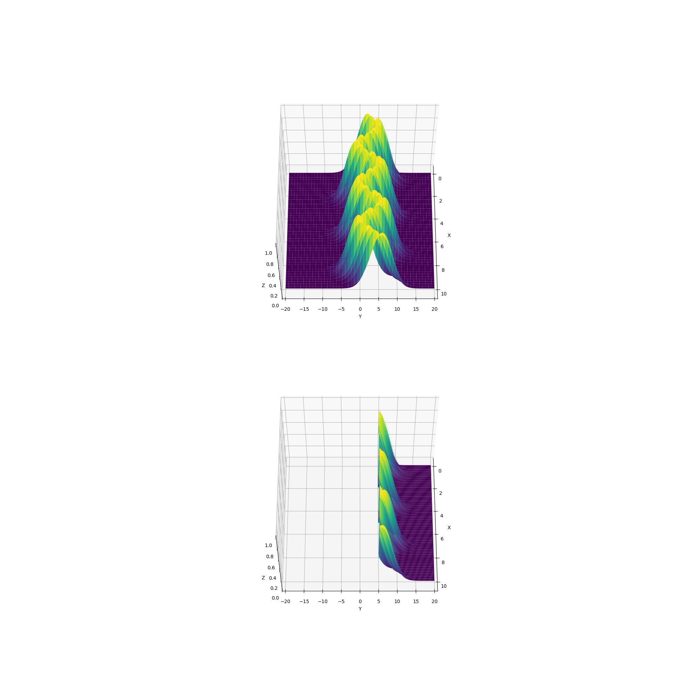

**Script Description: Gaussian Surface Probability Plotter**

This script generates a 3D surface plot of a Gaussian function and calculates the probability of the function's values exceeding a specified threshold within a given range. The key components of the script include:

1. **Gaussian Function Definition:**
    - The script defines a Gaussian function with parameters `amp_`, `mean`, and `std_`. This function models a Gaussian distribution in two dimensions.

2. **Surface Function:**
    - A surface function is defined using the previously defined Gaussian function. This surface represents the distribution in three dimensions, with parameters `amp`, `std`, and `trend` defining the shape.

3. **Probability Calculation:**
    - The script calculates the probability of the surface values exceeding a specified threshold (`y_lower_bound`) within a specified range of x-values. It uses double integration to compute both the segment volume (values above the threshold) and the total volume of the surface.

4. **3D Surface Plotting:**
    - A function is provided to create a 3D surface plot of the defined function. The script generates two subplots, each showcasing a different range of the surface.

5. **Parameter Configuration:**
    - Parameters such as the amplitude (`amp`), standard deviation (`std`), and trend function (`trend`) are set to specific values, shaping the characteristics of the Gaussian surface.

6. **Integration Limits and Visualization:**
    - Integration limits for the double integral are specified for both x and y dimensions. The script then visualizes the surface and the probability calculation results through a 3D plot with two subplots.

7. **Output:**
    - The script prints the segment volume, total volume, and the estimated probability of values exceeding the specified threshold. These metrics provide insights into the distribution of the Gaussian surface within the defined range.

This script serves as a tool for visualizing and analyzing the behavior of a Gaussian distribution in a three-dimensional space, offering insights into the likelihood of specific values occurring within a given range. Users can customize parameters and integration limits to explore different scenarios and gain a deeper understanding of the Gaussian surface's characteristics.

Example:
